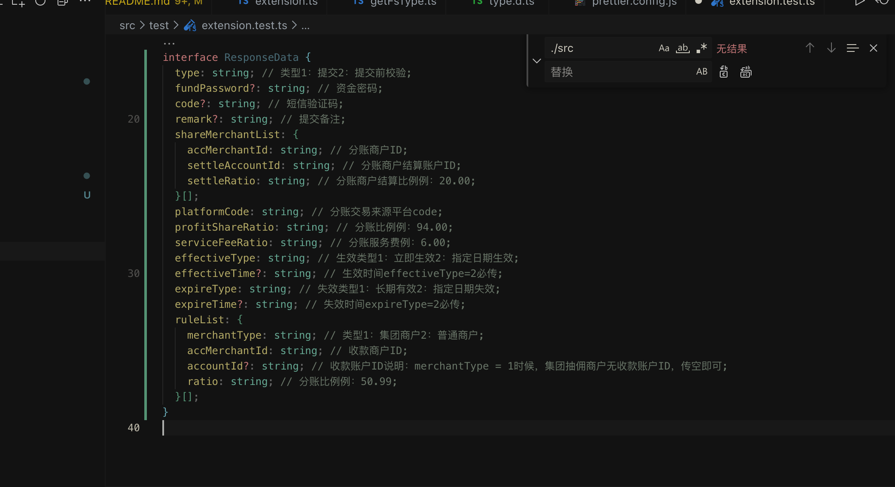
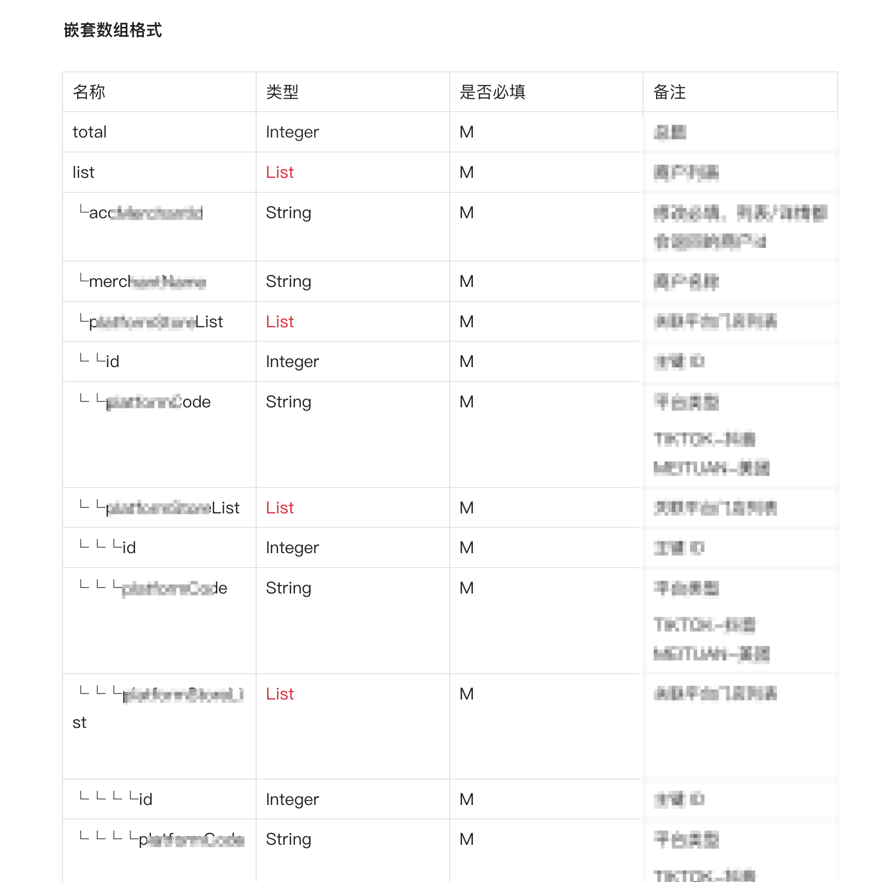
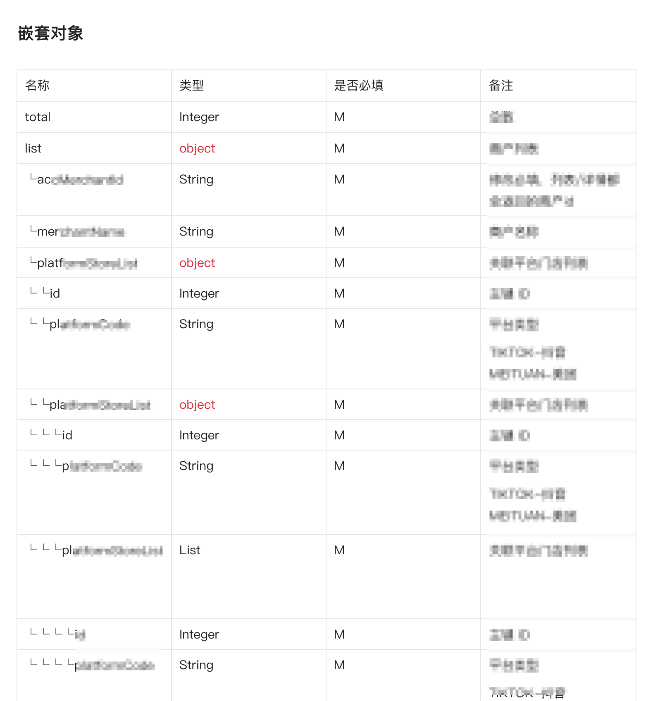

### 🌈 **transtype**: 你的VSCode TypeScript类型生成器！

**VSCode插件**，能够将json数据或经过**谷歌浏览器插件Atom Honeycomb**格式化后的markdown表格数据转换成TypeScript类型定义。

[谷歌浏览器插件点击直达](https://chromewebstore.google.com/search/Atom%20Honeycomb?hl=zh-CN&utm_source=ext_sidebar)

### 📸 **示例演示**
- 通过浏览器插件**Atom Honeycomb**将语雀表格数据格式化后，使用**transtype**插件生成TypeScript类型。

### 📦 **安装** 
- 打开VSCode，前往插件商店，搜索 **"transtype"**，一键安装，让你的代码库焕发新生！

### 🔧 **使用指南（轻松三步走）**

#### 第1步：启动魔法
- 按下 **F1** 键，召唤出VSCode的控制台。
- 输入 **"transtype"**，选择那个带有🌿图标的选项，开启TypeScript类型生成的魔法之旅！

#### 第2步：输入咒语
- 在弹出的神秘输入框中，输入你的json数据或格式化后的markdown表格数据。这将是我们的咒语原料！

#### 第3步：见证奇迹
- 轻轻一击回车键，TypeScript类型就如同魔法一般自动出现在你的编辑器中，为你的数据赋予结构和意义。

---

**两种方式详解：**

1. **直接使用JSON数据：**
   - 将你的JSON数据直接复制粘贴到VSCode的“transtype”插件输入框中。
   - 回车，插件将自动将JSON数据转换为TypeScript接口。

2. **使用Atom Honeycomb格式化Markdown表格：**
   - 首先，确保你已经安装了谷歌浏览器插件**Atom Honeycomb**。
   - 在语雀或其他Markdown编辑器中编辑你的表格数据。
   - 使用**Atom Honeycomb**将Markdown表格数据格式化为JSON。
   - 将格式化后的JSON数据复制粘贴到VSCode的“transtype”插件输入框中。
   - 回车，插件将自动将格式化后的JSON数据转换为TypeScript接口。

### 🌈 对于后端接口语雀文档表格定义字段的要求

 以下为最佳示例
 

#### 对于嵌套数组

#### 对于嵌套对象

#####  具体表现为：
- 表格为四项 
- 名称
- 类型
- 是否必填 
- 字段描述
  
##### 下列是对四个表头的具体描述/要求：
● 名称
- 字段名称
- 驼峰法命名
- 如果该项为数组的某一项，则该名称以└ 开头，直至该组数组的所有项穷举完毕

● 类型标记映射
- 字符类型 --- 【String、string】
- 数字类型 --- 【Number、number、Int、int、Integer、interge】
- 布尔类型 --- 【Boolean、boolean】
- 数组类型 --- 【List、list、Array、array】

● 是否必填
- M --- 【必填】
- O --- 【非必填】

● 字段描述
- 无特别要求，正常描述即可

---

### 🍭 **反馈与建议**
- 有更棒的想法或魔法配方？[点这里留言](https://github.com/LinHanlove/transtype/issues/new)，让我们一起让魔法更加强大！